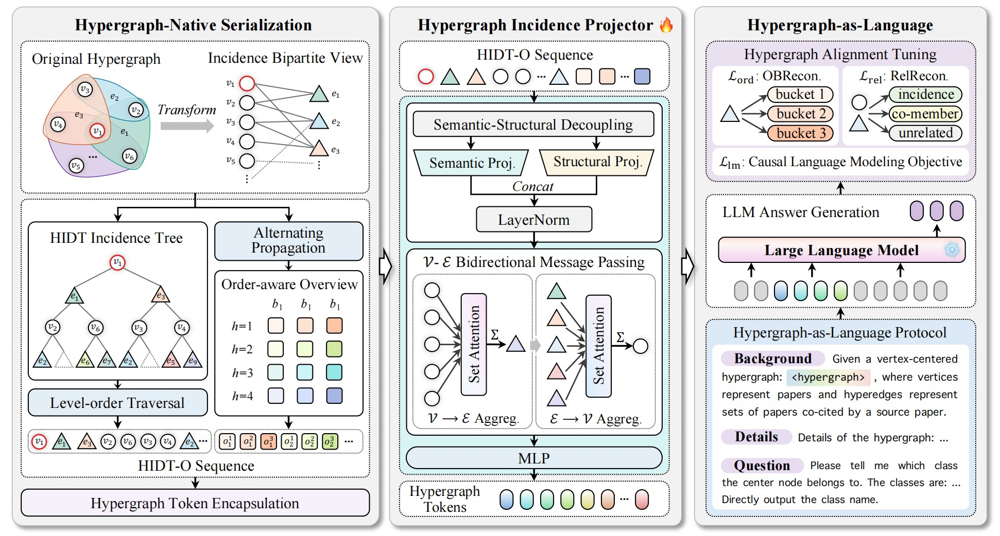
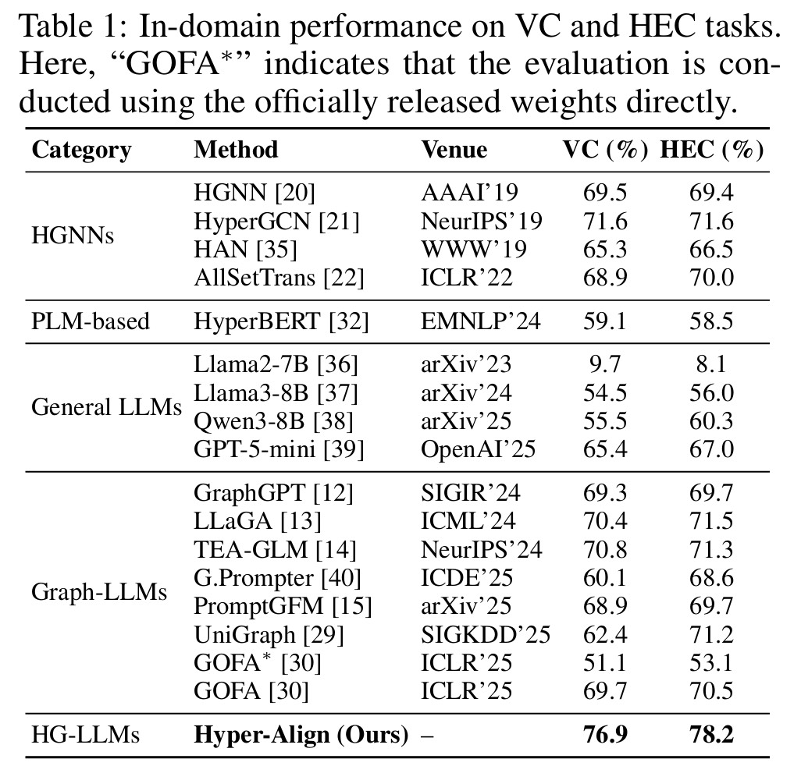
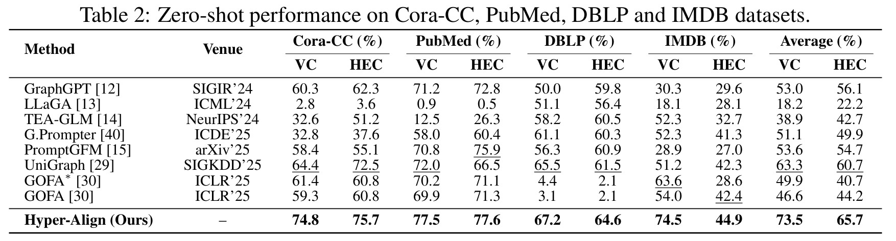

<h1 align="center">Hypergraph as Language</h1>
<h2 align="center">Implementation of the Proposed Hyper-Align and HyperAlign-Bench</h2>

## Overview 🔍

This repository provides the implementation of **Hyper-Align** and **HyperAlign-Bench**. The project follows the paper's **Hypergraph as Language** perspective: instead of flattening a hypergraph into pairwise edges or only rewriting it into text, Hyper-Align makes query-object-centered high-order association structures directly consumable by large language models.

### Hyper-Align

- Hyper-Align is a hypergraph-native alignment framework for LLMs. Given a center object, either a vertex or a hyperedge, it compiles the surrounding high-order relational context into a sequence of continuous hypergraph tokens.
- The resulting token sequence is injected into a frozen base LLM together with a natural-language prompt, enabling downstream prediction under a unified question-answering paradigm.
- The released recipe uses Qwen3-8B as the base LLM, Qwen3-Embedding-0.6B as the text encoder, and projector-only tuning for hypergraph alignment.

<p align="center">
  
</p>

### HIDT-O, HIP, and the Hypergraph-as-Language Protocol

- **HIDT-O** serializes high-order association structures from the vertex-hyperedge incidence perspective. It combines fine-grained local incidence details with overview-level summaries over hop distances and hyperedge-degree buckets.
- **HIP** maps the semantic and structural information in HIDT-O into the LLM token space through semantic-structural decoupling and incidence-driven bidirectional message passing between vertices and hyperedges.
- The concrete input interface uses a three-part **Background-Details-Question** prompt, where continuous hypergraph tokens and deterministically rendered textual context are jointly provided to the frozen LLM.

### HyperAlign-Bench

- HyperAlign-Bench is a benchmark for evaluating high-order association modeling in hypergraph-language alignment.
- It contains two dual tasks: vertex classification (**VC**) and hyperedge classification (**HEC**), supporting both in-domain and zero-shot evaluation.
- The release covers Arxiv-HG, Cora-CC, PubMed, DBLP, and IMDB, with processed hypergraph tensors, task samples, Qwen3-Embedding features, and overview features.


## Main Results 🏆

<p align="center">
  
</p>

<p align="center">
  
</p>

## Quick Start 🚀

### 1. Environment Setup

Create a fresh conda environment for the release:

```bash
conda create -n hyperalign python=3.10 -y
conda activate hyperalign

# Install a PyTorch build that matches your CUDA setup.
# Example for CUDA 12.1:
pip install torch torchvision torchaudio --index-url https://download.pytorch.org/whl/cu121

cd Hyper-Align
pip install -r requirements.txt

cd ../HyperAlign-Bench
pip install -r requirements.txt
```

If your CUDA or driver version differs, install the matching PyTorch build before installing the project requirements.

### 2. Weight Preparation

Download the Hyper-Align checkpoint from the GitHub Releases link listed in [DOWNLOADS.md](DOWNLOADS.md). Base LLMs and embedding models should be obtained from their official pages, not from this project.

Place the Hyper-Align checkpoint at:

```text
Hyper-Align/checkpoints/hyper-align-qwen3-8b-qwen3emb0.6b-hidt-o-hip-joint2ep/
```

The main checkpoint uses:

- Base LLM: [Qwen/Qwen3-8B](https://huggingface.co/Qwen/Qwen3-8B)
- Feature encoder: [Qwen/Qwen3-Embedding-0.6B](https://huggingface.co/Qwen/Qwen3-Embedding-0.6B)

For training and evaluation with the released data bundle, only the base LLM is loaded at runtime; the `qwen3emb_0.6b` features are already included. The embedding model is needed when rebuilding features or preparing a custom dataset.

### 3. Data Preparation

Download the full HyperAlign-Bench data bundle from the Google Drive or Baidu Netdisk link in [DOWNLOADS.md](DOWNLOADS.md), then extract it so the dataset directory is organized as:

```text
HyperAlign-Bench/dataset/
  arxiv_hg/
  cora_cc/
  pubmed/
  dblp/
  imdb/
```

Each dataset directory should contain:

```text
processed_data.pt
meta.json
samples/
embeddings/qwen3emb_0.6b/
overview/qwen3emb_0.6b/
```

The released data bundle already includes prebaked task samples and overview features. For a custom dataset following the same format, run:

```bash
cd Hyper-Align

bash scripts/prepare_dataset.sh ../HyperAlign-Bench/dataset/arxiv_hg \
  --emb-type qwen3emb_0.6b
```

### 4. Training

Train the HIP projector jointly on Arxiv-HG VC and HEC:

```bash
cd Hyper-Align

MODEL_BASE=Qwen/Qwen3-8B \
HYPER_DATA_ROOT=../HyperAlign-Bench/dataset/arxiv_hg \
bash scripts/train_arxiv_hg_joint_vc_hec_2ep.sh
```

The default training recipe uses:

- `MODEL_BASE=Qwen/Qwen3-8B`
- `EMB_TYPE=qwen3emb_0.6b`
- `HYPER_TEMPLATE=HIDT_O`
- `PROJECTOR_TYPE=htp`
- `NUM_EPOCHS=2`
- `BATCH_SIZE=8`
- `GRAD_ACCUM=2`
- `USE_DEEPSPEED=1`

Checkpoints are saved under:

```text
Hyper-Align/checkpoints/arxiv_hg/
```

### 5. Evaluation

Run a small VC smoke evaluation on Arxiv-HG:

```bash
cd Hyper-Align

BASE_MODEL=Qwen/Qwen3-8B \
EVAL_RANDOM_SAMPLE_SIZE=20 \
bash scripts/evaluate_arxiv_hg_vc.sh \
  ./checkpoints/hyper-align-qwen3-8b-qwen3emb0.6b-hidt-o-hip-joint2ep \
  0 100 smoke
```

Run HEC on Arxiv-HG:

```bash
BASE_MODEL=Qwen/Qwen3-8B \
EVAL_RANDOM_SAMPLE_SIZE=20 \
bash scripts/evaluate_arxiv_hg_hec.sh \
  ./checkpoints/hyper-align-qwen3-8b-qwen3emb0.6b-hidt-o-hip-joint2ep \
  0 100 smoke
```

Evaluation wrappers follow:

```text
scripts/evaluate_<dataset>_<task>.sh
```

where `<dataset>` is one of `arxiv_hg`, `cora_cc`, `pubmed`, `dblp`, `imdb`, and `<task>` is `vc` or `hec`.

### 6. Building Arxiv-HG

If you want to rebuild Arxiv-HG from raw OGBN-Arxiv files:

```bash
cd HyperAlign-Bench

export HYPERALIGN_ROOT=../Hyper-Align
bash scripts/build_arxiv_hypergraph_dataset.sh
bash scripts/build_dataset_text_embeddings.sh
```

The builder outputs the HyperAlign-Bench package format expected by the runtime.

## Repository Structure 📃

```text
Hyper-Align/
  model/                         # Qwen3/LLaMA wrappers, HIP projector, builder
  train/                         # Projector training dataset and trainer
  eval/                          # Generation and metric entry points
  utils/                         # HIDT-O, features, templates, and text context
  scripts/                       # Prebake, train, and VC/HEC evaluation wrappers
  tests/                         # Lightweight HIDT checks
  checkpoints/                   # Place downloaded or trained checkpoints here

HyperAlign-Bench/
  hyperalign_bench/              # Benchmark construction package
  scripts/                       # Arxiv-HG build and text embedding scripts
  dataset/                       # Place the extracted data bundle here

assets/                          # Framework and result figures used by this README
DOWNLOADS.md                     # Checkpoint and dataset links
```
